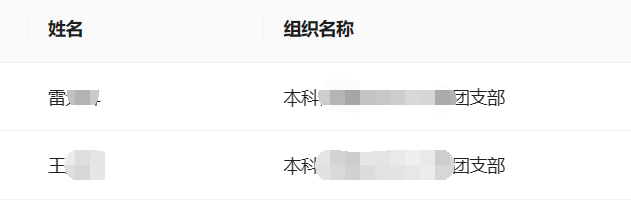

# Study Monitor for QNDXX

Study Monitor 是一个用于组织成员QNDXX学习情况的工具。该应用允许用户输入账号信息，选择期数和组织，获取组织成员的学习情况，并通过上传花名册文件进行对比。最终，用户可以查看和下载对比结果。

## 功能概述

- **用户信息输入**：用户可以输入用户名和密码，以获取组织的学习情况。
- **组织选择**：用户可以选择特定的期数 (Sid) 和组织 (Orgid)。
- **获取学习情况**：应用会根据输入的信息获取组织成员的学习情况。
- **文件上传**：用户可以上传自己的花名册文件进行对比。
- **对比结果**：应用会对比花名册文件和获取的学习情况，显示未匹配的列表。
- **使用说明**：提供详细的使用说明，帮助用户了解如何操作应用。

### 使用流程

1. **输入用户信息**
   - 输入用户名和密码。

2. **选择期数和组织**
   - 下拉框选择期数（如 `第八期 (sid: 79)`）。
   - 点击“选择组织列表Orgidsd”按钮，选择一个或多个组织。

3. **获取学习情况**
   - 点击“获取'已选组织'学习情况”按钮，获取所选组织的学习情况。

4. **上传花名册**
   - 点击'上传花名册'区域，选择花名册文件。

5. **核对学习情况**
   - 点击“对比”按钮，核对学习时间和完成情况。

6. **查看和下载结果**
   - 查看结果列表。
   - 点击'下载'按钮，下载对比结果文件。

### How to run

1. **克隆项目**
   ```sh
   git clone https://github.com/SurvivorNo1/studymonitor.git
   cd studymonitor
   ```

2. **安装依赖**
   ```sh
   npm install
   ```

3. **运行项目**
   ```sh
   npm run dev
   ```
## 代码结构

### 主组件 (App.tsx)

- **状态管理**：使用 React 的 `useState` 和 `useEffect` 钩子管理应用的状态，如用户信息、文件、组织数据等。
- **数据获取**：通过 `fetchCompleteLists` 和 `fetchCombinedData` 函数从服务器获取组织和学习数据。
- **文件上传和对比**：使用 `FileUpload` 组件上传文件，并通过 `compareExcels` 函数进行文件对比。
- **布局和样式**：使用 Ant Design 的 `Layout`、`Row`、`Col` 等组件进行页面布局，并通过 `Modal` 组件实现模态框功能。

### 子组件

- **FileUpload**：处理文件上传。
- **FilePreview**：预览上传的文件。
- **CompareResult**：显示对比结果。

### 服务 (services)

- **excelHandler.ts**：处理 Excel 文件的对比逻辑。
- **api.ts**：封装 API 调用，获取组织和学习数据。
- **types.ts**：定义数据类型。

## 免责声明

此项目仅用于学习和研究目的。开发者对任何人使用此项目造成的任何直接或间接后果不负责任。请勿将此项目用于任何非法用途或违反相关法规的行为。使用本项目即表示您同意自行承担使用过程中可能产生的所有风险和责任。

## 注意事项
- 上传的花名册文件后缀应为 .xlsx 格式，内容为"姓名"	"组织名称"两列。
